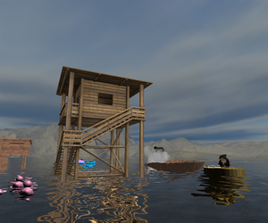
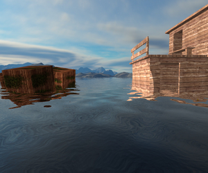
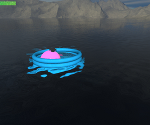

Šárka Prokopová – Semestrální projekt z předmětu BI-PGR.1   

Semestrální projekt z předmětu BI-PGR.1
=======================================

* * *

Horské jezero
-------------

### Šárka Prokopová

  

#### Zadání

Domek s věží na přilehlém horském jezeře, ideální místo pro prozkoumání. Loďka je rozbitá, avšak to nebrání v objevování dalších zákoutí. Právě díky tomu jen odvážní objeví nové objekty nechávající se unášet po vlnách. Po cestě člověk narazí i na živé tvory, které je možné rozpohybovat. Okolí v jeden moment zahalí mlha, avšak stačí si posvítit vlastní baterkou, nebo se ukrýt ve spodní části domu, kde by světlo ještě najít mohlo. Okolí je velmi osamocené a opředené několika tajemstvími, můžete jen hádat, co cestou potkáte.  
  
Okolí disponuje několika objekty s vlastními texturami, multitexturing byl využit u boxů s texturou trávy. K vytvoření realistické vodní plochy byly vytvořeny reflection a refraction buffery, které byly namapovány k dudv mapě a doplněny Fresnel efektem. Hierarchická transformace nenápadně určuje vlnění bazénu spolu s míčem, na kterém je položen klobouk klouzající se po míči. Status bar v levém horním rohu určuje rychlost pohybu.

#### Ovládání

### KLÁVESOVÉ ZKRATKY:

**Pohyb:** šipky (levá/pravá, nahoru/dolu)

**Pohyb nahoru/dolu:** "W/S"

**Mlha (zap/vyp):** "F"

**Změna podnebí:** "D"

**Baterka (zap/vyp):** "SPACE"

**Přepínání pozic:** "P"

**Zapnutí dynamické kamery:** "C"

**Zapnutí automatického pohybu kamery:** "M"

**Restart hry:** "R"

### INTERAKCE S OBJEKTY:

**Interakce s předměty:** Levé tlačítko myši

**Přístup do menu:** Pravé tlačítko myši

### DALŠÍ OVLÁDÁNÍ:

**Vypnutí aplikace:** Esc

* * *

Poslední aktualizace: 5.5.2020
